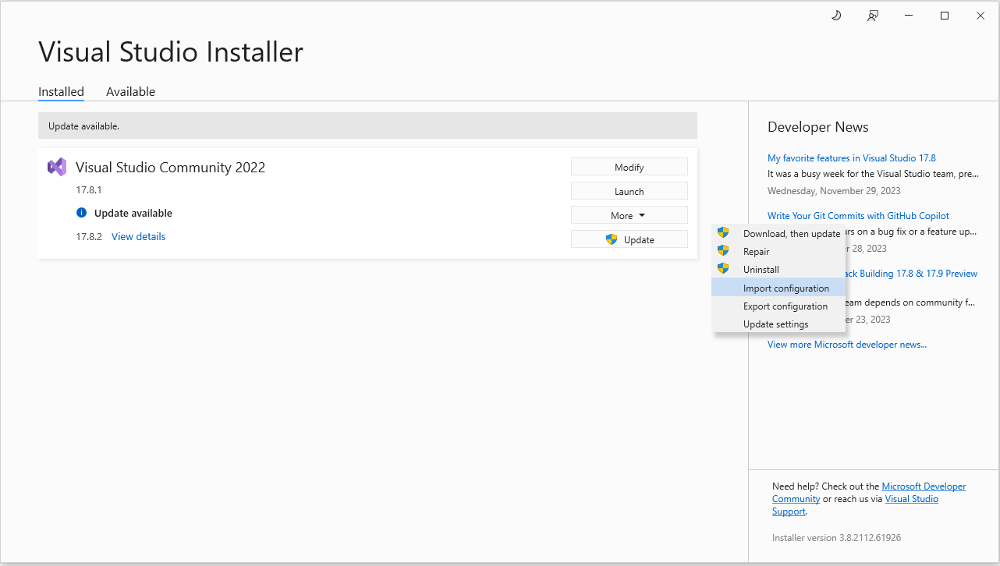

## Require

```
>= Windows 10 Pro 22H2 OS Build 19045.3693
Visual Studio 2022
PostgreSQL 16
ComponentOne 2023v2 (Active). Install UWP Edition (>=2023v2 790)
```


## Extensions

```
https://marketplace.visualstudio.com/items?itemName=TemplateStudio.TemplateStudioForUWP
```


## How to setup?


```
Open application:
  Visual Studio Installer
  import ~/project/universal-windows-platform-c#/.vsconfig
```

## Migration

### Turtorial
```
https://scriptbytes.io/postgresql-database-entity-framework-migrations/
https://github.com/ScriptBytes/TodoAPI/tree/migrations-postgres
```

### How to use?
```
Open Package Manager Console (Tools -> NuGet Package Manager -> Package Manager Console)
cd ~project/universal-windows-platform-c#.Core
Get-Help about_EntityFrameworkCore
```

### Add-Migration
```
Add-Migration <Name>
```